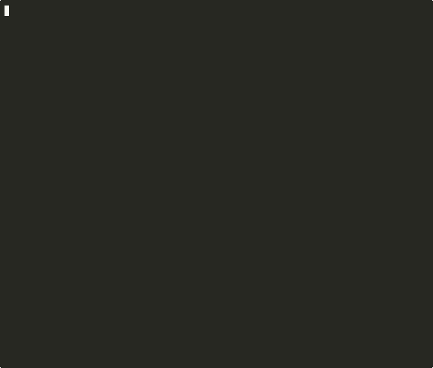

unipaste
========
`unipaste` converts HTML and rich clipboard data into plain text, Markdown, or terminal output.

When you copy formatted content from Slack, Microsoft Teams, Discord, Google Chrome, or other web apps into plain-text editors (Notepad, nano, vim), tables collapse into single lines, code blocks lose indentation, lists lose nesting, and links lose their target URLs. `unipaste` reads the rich HTML from standard input or files and formats tables, code blocks, lists, and links in plain text.

[](https://asciinema.org/a/ghzy8NsCYziHVaTO)

Features
--------
* Zero external runtime dependencies (standard C99 libc).
* Formats HTML tables and raw TSV grids into ASCII grid borders (`+---+---+`), Unicode box drawing (`┌─┬─┐`), Markdown pipe tables (`| a | b |`), Slack code blocks, Jira tables, or tab-separated values.
* Strips telemetry & tracking parameters (`utm_*`, `fbclid`, `gclid`, `ref_`, `si`, `rcm`) from links by default (`-K` to preserve).
* Extracts LaTeX formulas (`$E = mc^2$`, `$$\int f(x)dx$$`) from KaTeX, MathJax, and Wikipedia MathML fragments.
* Supports dialect outputs: **GitHub Markdown**, **Slack/Discord mrkdwn**, and **Jira/Confluence Wiki markup**.
* Preserves nested lists, numbered lists, and task checkboxes (`[ ]`, `[x]`).
* Keeps code block indentation, line breaks, and language tags (```` ```lang ````, `{code:lang}`).
* Formats links as bracketed URLs (`Text (https://...)`), inline Markdown (`[Text](https://...)`), Slack `<url|text>`, Jira `[text|url]`, or numbered footnotes.
* Decodes named and numeric HTML entities.
* Strips Windows clipboard metadata (`Version:0.9`, `<!--StartFragment-->`).
* Optional compile-time HTML sanitizer plugin to strip unsafe tags and scripts before parsing.

Build and Install
-----------------

### Build from Source
```sh
git clone https://github.com/riccivr/unipaste.git
cd unipaste
make
sudo make install
```
Edit `config.mk` to change the install prefix (`/usr/local` by default) or compiler flags.

---

### Package Managers

#### Homebrew (macOS and Linux)
```sh
brew tap riccivr/tap
brew install unipaste
```

#### Arch Linux (AUR)
```sh
yay -S unipaste
```

#### Debian and Ubuntu (.deb)
```sh
sudo dpkg -i unipaste_1.1.0_amd64.deb
```

#### Windows (Chocolatey)
```powershell
choco install unipaste
```

---

### Pre-built Binaries
Download pre-compiled binaries for Linux (x86_64), Windows (`unipaste.exe`), and Debian `.deb` packages from the [GitHub Releases](https://github.com/riccivr/unipaste/releases) page.

HTML Sanitizer
--------------
By default, official releases and standard builds include the built-in HTML sanitizer (`plugin_builtin.c`). It strips unsafe scripts (`<script>`, `<style>`, `<iframe>`, `object`, `embed`) and inline event handlers (`onclick`, `onload`, `onerror`) while having **zero external runtime dependencies** (pure standard C99 libc).

### Zero-Sanitizer Pass-Through Build
If you want raw pass-through without any HTML tag stripping:

```sh
make SANITIZE=none
```

### Custom Sanitizers
To use a custom HTML cleaner, create a C file that defines `sanitize_html`:

```c
#include "plugin.h"

char *sanitize_html(const char *input, size_t len)
{
    /* return allocated string for caller to free, or NULL on error */
}
```

Build with:
```sh
make PLUGIN_SRC=plugin_custom.c
```

Tests
-----
* **Unit and Golden Snapshot Tests**: `make test`
* **Zero-Sanitizer Pass-Through Tests**: `make SANITIZE=none test`
* **Pathological and Stress Tests**: `make stress`
* **AddressSanitizer and UBSan**: `make sanitize`
* **Valgrind Memcheck**: `make valgrind`
* **LibFuzzer**: `make fuzz`

Usage
-----
```
unipaste [-urvKh] [-m mode] [-t table] [-l link] [file ...]
```

### Options
* `-m mode`: Output mode: `plain` (default), `markdown`, `slack` (mrkdwn), `jira` (Confluence wiki), `terminal`.
* `-t table`: Table style: `grid` (default), `markdown`, `tsv`, `simple`.
* `-l link`: Link format: `bracket` (default for plain), `inline` (default for markdown), `text`, `footnote`.
* `-K`: Keep URL tracking & telemetry parameters (`utm_*`, `fbclid`, `gclid`, etc.).
* `-u`: Use UTF-8 Unicode box-drawing characters for tables.
* `-r`: Emit Windows CRLF (`\r\n`) line endings.
* `-v`: Print version information.
* `-h`: Display help message.

Examples
--------
Convert clipboard HTML on X11:
```sh
xclip -selection clipboard -t text/html -o | unipaste
```

Convert clipboard HTML on Wayland:
```sh
wl-paste -t text/html | unipaste
```

Convert an HTML file to GitHub-Flavored Markdown:
```sh
unipaste -m markdown document.html > document.md
```

Render tables with Unicode box borders:
```sh
unipaste -u input.html
```

Convert links to numbered footnotes at the end of the text:
```sh
unipaste -l footnote article.html
```

License
-------
MIT License. See LICENSE file for details.
